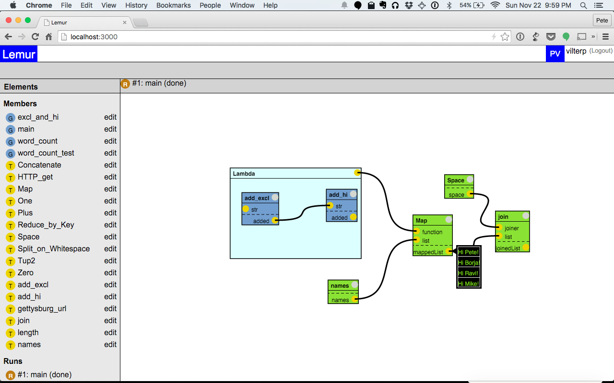

# Lemur

My senior thesis in CS at the University of Chicago, advised by Borja Sotomayor. Special thanks to Ravi Chugh (UChicago CS) and Mike Wilde (UChicago Computation Institute/Argonne National Lab).



- [Paper](https://docs.google.com/document/d/1Sd0RF3Ul2nyFs834MJ5BP1SrVGSguKXNKusAHMhyBL8/edit#heading=h.yancnoidrolk) (background, related work, explanation of key data structures & algos w/ source links, etc)
- [Talk Slides](https://docs.google.com/presentation/d/19oM5iH6eHpxGSPq8d3NrCeqqdNWBx45QPAPJh2bOt80/edit?usp=sharing) (incl. screenshots)
- Videos: (note: right sidebar filled w/ Lorem Ipsum has since been removed)
  - [Running, Progress Viz, Inspecting Results](https://www.youtube.com/watch?v=0RPQLO46_v0)
  - [Calling a graph function from another graph function](https://www.youtube.com/watch?v=hzKBwhUB9zg)

## Requires

1. Elm 0.16 (elm-lang.org)
2. Node.js 0.12
3. Python 2.7

## How to run

### With Docker

```
$ docker run -p 3000:3000 vilterp/lemur
```

### By Hand

In root directory:

1. `$ make deps` (installs Elm and Node packages)
2. `$ make` (compiles Elm code)
3. `$ node server.js`
3. Open browser to [http://localhost:3000/](http://localhost:3000/)
